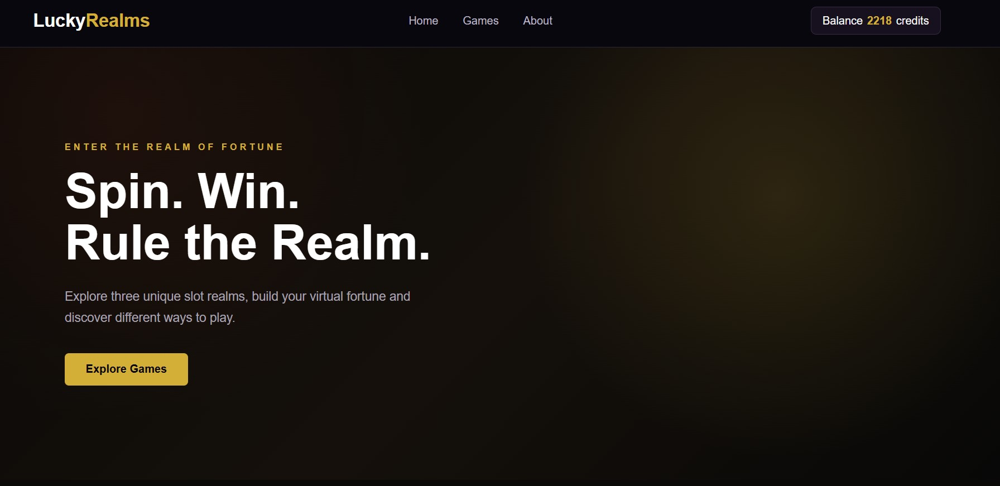
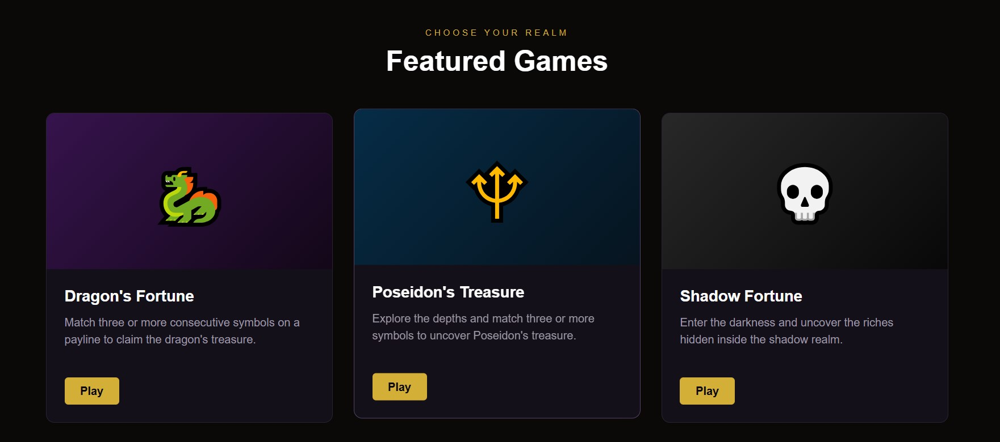
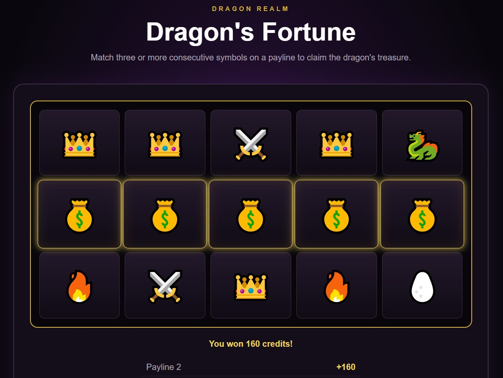
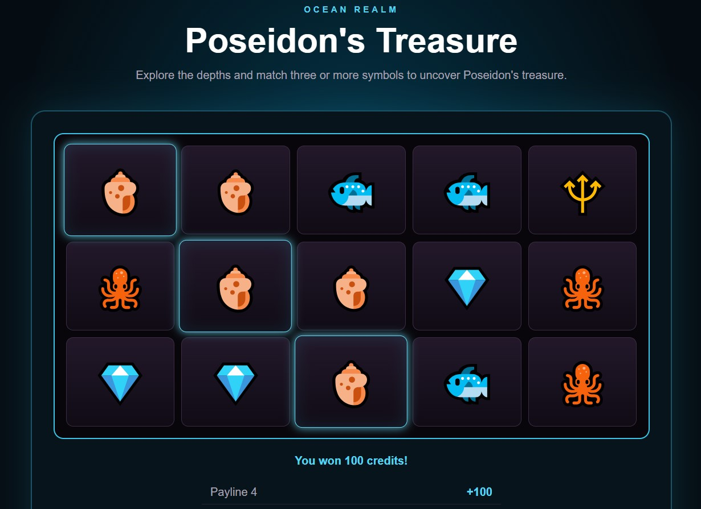
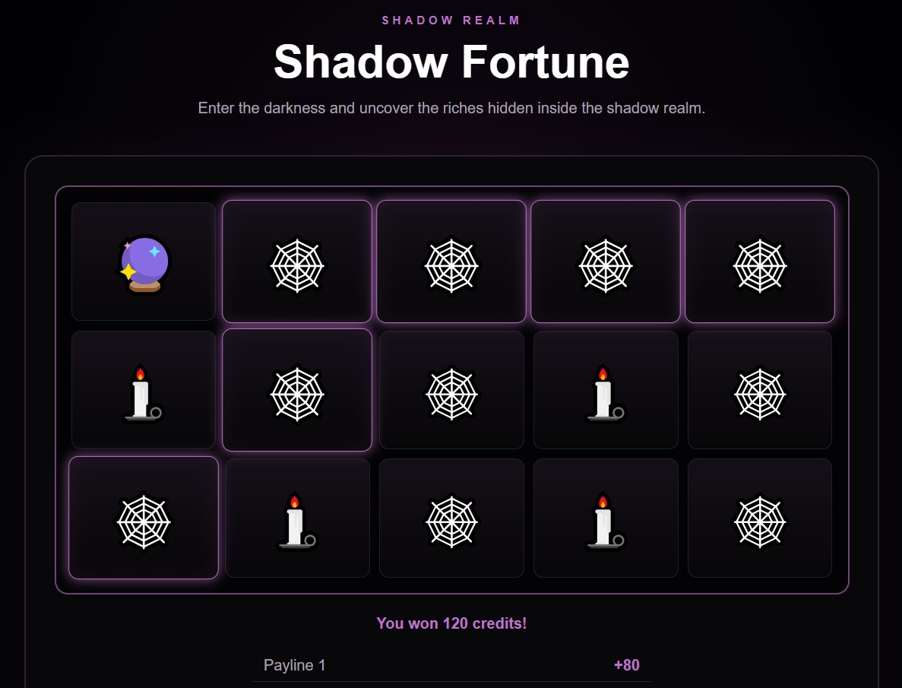

# LuckyRealms

LuckyRealms is a browser-based virtual slot casino built with HTML, CSS and vanilla JavaScript.

The project features multiple themed slot machines powered by a shared reusable slot engine, while each game keeps its own visual identity, symbol probabilities, payouts, bonus mechanics and statistics.

LuckyRealms uses virtual credits only. No real-money gambling is involved.

## Live Demo

[Play LuckyRealms](https://gmihalev404.github.io/LuckyRealms/)

## Games

### Dragon's Fortune 🐉

A fantasy-themed slot with higher volatility, rare high-value symbols and Dragon Egg bonus symbols.

### Poseidon's Treasure 🔱

An ocean-themed slot with more balanced symbol distribution and steadier payouts.

### Shadow Fortune 💀

A dark high-volatility slot focused on rarer wins and larger possible payouts.

## Features

- 5×3 slot grid
- 5 active paylines
- Weighted random symbols
- Different payouts and volatility per game
- Shared virtual credit balance
- Separate statistics for each slot machine
- Win highlighting
- Payline win breakdown
- Bonus symbols
- Free spins
- Persistent data using `localStorage`
- Responsive layout
- Individual visual themes for every realm
- Dynamically generated game cards
- Shared generic slot engine

## Architecture

The slot machines share one reusable engine:

```text
                 GAME_CONFIGS
                /     |      \
          Dragon   Poseidon   Shadow
               \      |      /
                  slots.js
               generic engine

                    ↓

                 home.js
          generates game cards
```

Game-specific behavior is defined inside `game-configs.js`.

This makes it possible to add new slot machines without duplicating the core slot logic.

## Project Structure

```text
LuckyRealms/
├── index.html
├── games/
│   └── slots.html
├── css/
│   ├── style.css
│   └── slots.css
├── js/
│   ├── app.js
│   ├── home.js
│   ├── game-configs.js
│   └── slots.js
├── assets/
│   └── screenshots/
├── architecture.txt
└── README.md
```

## Technologies

- HTML5
- CSS3
- JavaScript
- Web Storage API (`localStorage`)
- Git
- GitHub

No frameworks or external JavaScript libraries are required.

## Running the Project

Clone the repository:

```bash
git clone https://github.com/gmihalev404/LuckyRealms.git
```

Open the project folder and launch `index.html` in a browser.

For development, using the VS Code Live Server extension is recommended.

## Game Data

Each game defines its own:

- symbols
- symbol weights
- payout multipliers
- bonus symbol
- number of awarded free spins
- theme
- statistics storage key

The shared slot engine reads the selected game's configuration dynamically.

## Persistence

LuckyRealms uses browser `localStorage` to preserve:

- shared credit balance
- game statistics
- available free spins

Because the project currently has no backend, this data is stored locally in the user's browser.

## Screenshots

### Home




### Dragon's Fortune


### Poseidon's Treasure


### Shadow Fortune


## Author

Georgi Mihalev
